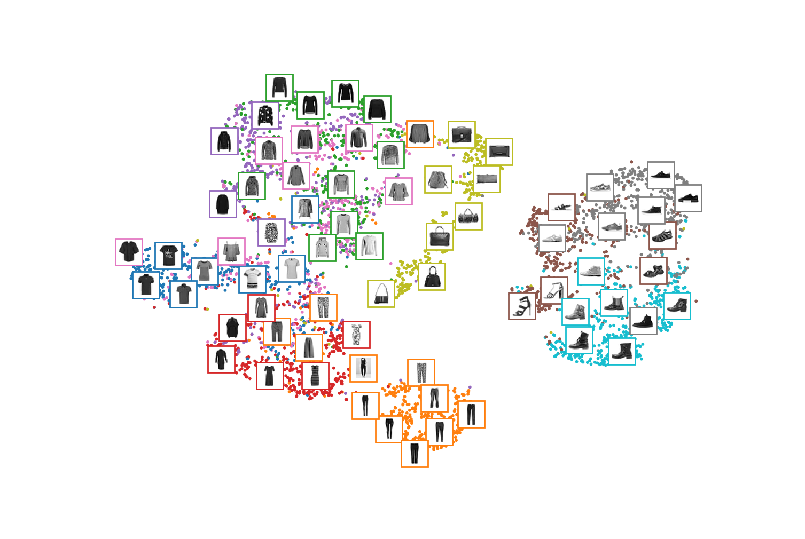
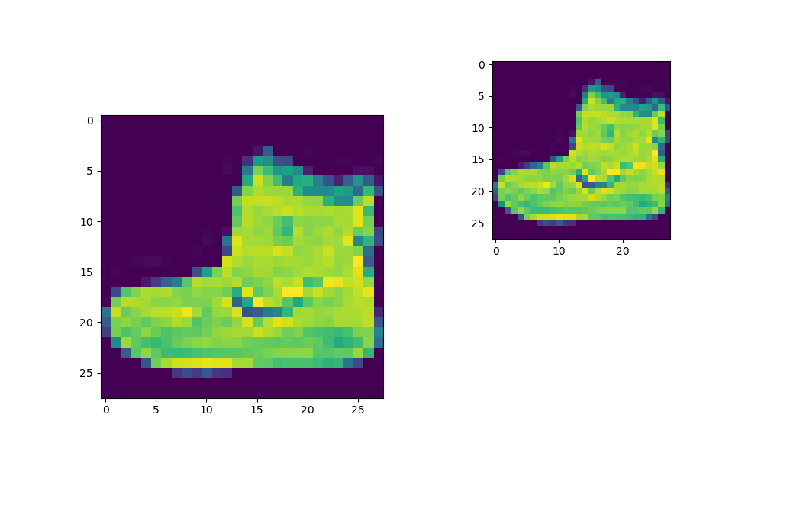

# MNIST Unsupervised visualization - CNN Clustering using TSNE
By [Sudharsan Ananth](https://sudharsanananth.wixsite.com/sudharsan) 

<!-- TABLE OF CONTENTS -->
<details>
  <summary>Table of Contents</summary>
  <ol>
    <li><a href="#about-this-project">About this Project</a></li>
    <li><a href="#dependencies">Dependencies</a></li>
    <li><a href="#prerequisites">Prerequisites</a></li>
    <li><a href="#run-the-code">How to run</a></li>
    <li><a href="#license">License</a></li>
  </ol>
</details>


## About this Project 

This project is used to visualize clustering using unsupervised learning. There are 2 codes in this repo. notebook `mnist_visualization.ipynb` for clustering MNIST dataset using basic pytorch and `fashion_mnist_visualization.py` using optimization tools like pytorch-lightning. This method can be used in various other datasets to catagorize unlabelled data. 

First a unsupervised model consisting on encoder and decoder archetecture to train the model without labels. After successful training, the encoder and decoder will be able to recreate images as closely as possible. 

Then encoder will be decoupled and seperated, images will be passed to the network the output of encoder will be fed to TSNE for dimensionality reduction and cluters can be visualised. 


### Clustering Image



### Recreation Image



## Dependencies 

This project is built with the below given major frameworks and libraries. The code is primarily based on python. 

* [Python](https://www.python.org/) 
* [pytorch](https://pytorch.org/)
* [matplotlib](https://matplotlib.org/) 
* [scikit-learn](https://scikit-learn.org/stable/) 
* Optional - [pytorchlightning](https://www.pytorchlightning.ai)

## Prerequisites

conda environment is ideal for creating environments with the right packages. Pip is required to install the dependencies.

* [Anaconda](https://www.anaconda.com) or [miniconda](https://docs.conda.io/en/latest/miniconda.html)
* [pip](https://pypi.org/project/pip/)


## Run the code

Simply clone the repo cd into the right directory and run the code. Step-by-Step instructions given below. 

1. Clone the repository using 
   ```sh
   git clone https://github.com/sudharsan-007/jetrat.git
   ```

2. cd into the directory RL-DQN-Snake-Game
   ```sh
   cd jetrat
   ```

3. Create a Environment using
   ```sh
   conda create -n unsupervised_mnist
   conda activate unsupervised_mnist
   ```


4. Install pyTorch. Use pip if conda doesn't work. 
    ```sh 
    # https://pytorch.org/get-started/locally/
    conda install pytorch torchvision torchaudio cpuonly -c pytorch
    ```

5. Install Dependencies
   ```sh
   pip install matplotlib 
   pip install -U scikit-learn
   ```

6. Open the jupyter notebook `mnist_visualization.ipynb` and run the cells.
   ```sh 
   conda install pytorch torchvision torchaudio cpuonly -c pytorch
   ```

7. Optional - Run `fashion_mnist_visualization.py`. (*Pytorch lightning required*)
    ```sh 
    python main.py
    ```


<!-- LICENSE -->
## License

Distributed under the MIT License. See `LICENSE.txt` for more information.

<p align="right">(<a href="#top">back to top</a>)</p>